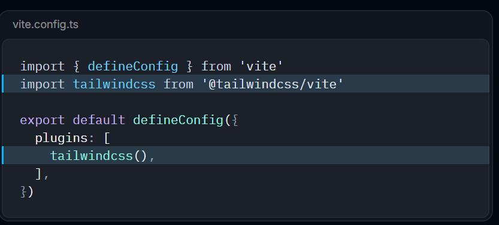

- [Root README file](../README.md)
# **Client Notes**
### Steps to setup the react project
- `npm create vite@latest my-project`
- `cd my-project`
- `npm install tailwindcss @tailwindcss/vite`
- Configure the Vite plugin   in the vite.config.ts add this line  `import tailwindcss from '@tailwindcss/vite'`

- import this statement in index.css `@import "tailwindcss";`

